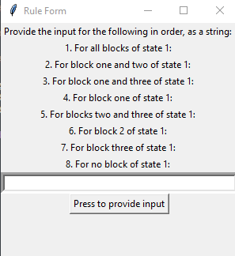
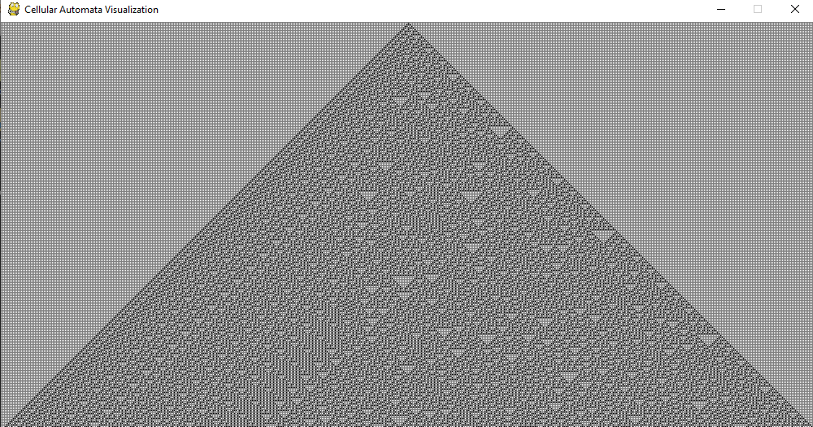
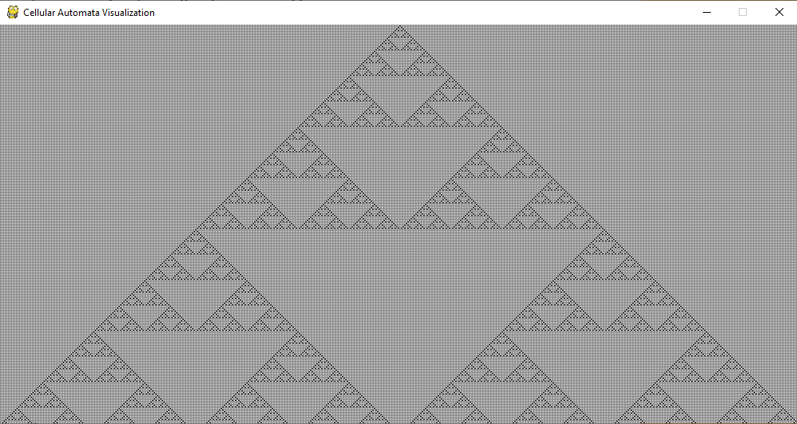

Cellular Automata Visualizer in pygame
------------------------------------------------------------------
The program uses a tkinter GUI to take the string of "1"s and "0"s that represent the rule you want to visualize. It then displays the rule using pygame.

